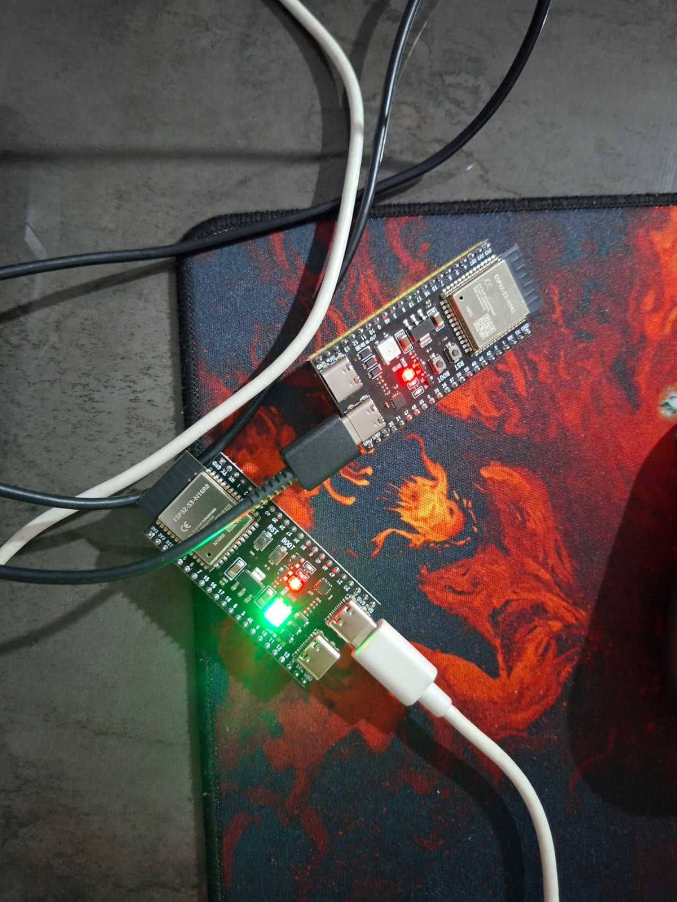

# ESP32SPIDER

<p>
  
  
  
  
  
</p>

## Overview

A Wi-Fi communication layer between ESP32-based robots and a ground station. Robots send telemetry and the ground
station sends commands over TCP, on top of which a small reliability protocol runs: stop-and-wait ARQ with ACK/NACK,
CRC8 checks, 500 ms timeouts with up to 5 retries, idempotent handling of duplicate messages, sequence-number
rollover protection and PING/PONG liveness checks. A Python CLI shows the data and sends commands; test builds of
the firmware inject faults (dropped ACKs or commands, corrupted CRCs) for a 20-case test plan.

**Quick start:** `bash kurulum_ubuntu.sh && bash yukle_server.sh /dev/ttyUSB0 && python3 ground_station.py`

## Proje hakkında

ESP32 tabanlı robotlarla yer istasyonu arasında Wi-Fi üzerinden çalışan bir haberleşme katmanı. Robotlar telemetri,
yer istasyonu komut gönderir. TCP üzerinde güvenilirliği sağlayan küçük bir protokol çalışır.

```text
[Python ground_station.py] ←USB seri→ [ESP32 server / erişim noktası]
                                              ↕ Wi-Fi, TCP 5000
                                       [ESP32 client (robot, SPIDER_3)]
```

<p align="center"></p>

## Özellikler

- **Mesaj formatı:** tek satır JSON, `{"id","seq","type","crc","payload"}`. Tipler: `DATA`, `CMD`, `ACK`, `NACK`,
  `PING`, `PONG`.
- **Stop-and-wait ARQ:** ACK gelene kadar yeni DATA/CMD gönderilmez; 500 ms'de ACK gelmezse aynı `seq` ile tekrar,
  en fazla 5 deneme, sonra bağlantı yeniden kurulur.
- **CRC8 doğrulama:** bozuk mesaja NACK, gönderen yeniden dener; NACK tekrarları da deneme sayısına dahildir.
- **Idempotency:** aynı `seq` ikinci kez gelirse yeniden işlenmez, yalnızca ACK tekrar gönderilir. `seq` 65535'ten
  başa döndüğünde (rollover) yanlış tekrar tespiti engellenir.
- **Canlılık:** 5 sn sessizlikte PING, 10 sn hiç mesaj gelmezse bağlantı ölü sayılır.
- **Durum göstergesi:** her iki kartta NeoPixel RGB LED.
- **Hata enjeksiyonu:** `*_testler` sürümleri ACK/CMD düşürme, bozuk CRC ve gecikme gibi hataları komutla üretir.
- **Yer istasyonu:** otomatik port bulma, canlı veri, komut satırı ve her oturum için log dosyası.

Ayrıntılar: [`PROTOKOL.md`](PROTOKOL.md) (protokol), [`DURUM_MAKINESI.md`](DURUM_MAKINESI.md) (durum makineleri),
[`TEST_PLANI.md`](TEST_PLANI.md) (T01–T20 test senaryoları).

## Kurulum ve çalıştırma (Ubuntu 22.04)

**1. Kurulum** (ilk kez): `pyserial`, `arduino-cli`, ESP32 kart paketi ve Adafruit NeoPixel kütüphanesini kurar.

```bash
bash kurulum_ubuntu.sh
```

**2. Wi-Fi bilgileri.** Her çizim klasöründeki (`server/`, `client/`, `server_testler/`, `client_testler/`)
`secrets.example.h` dosyasını `secrets.h` adıyla kopyalayıp ağ adı ve şifreyi girin. `secrets.h` depoya eklenmez.

```bash
for d in server client server_testler client_testler; do cp $d/secrets.example.h $d/secrets.h; done
```

**3. Portları bulun:**

```bash
bash port_bul.sh
# /dev/ttyUSB0  |  Silicon Labs - CP2102 USB to UART Bridge
# /dev/ttyACM0  |  Espressif - USB JTAG/serial debug unit
```

**4. Kartlara yükleyin:**

```bash
bash yukle_server.sh /dev/ttyUSB0
bash yukle_client.sh /dev/ttyUSB1
```

`yukle_*.sh` içindeki `BOARD` değişkenini kartınıza göre ayarlayın: ESP32-S3 için `esp32:esp32:esp32s3`
(varsayılan), klasik ESP32 için `esp32:esp32:esp32`, ESP32-C3 için `esp32:esp32:esp32c3`.

**5. Yer istasyonunu başlatın:**

```bash
python3 ground_station.py                          # port otomatik bulunur
python3 ground_station.py /dev/ttyUSB0             # port elle
python3 ground_station.py /dev/ttyUSB0 logum.txt   # log dosyası adıyla
```

Her çalıştırmada `log_YYYYMMDD_HHMMSS.txt` dosyası oluşturulur.

### Komutlar

`ground_station.py` çalışırken terminale yazın:

| Komut | Açıklama |
|-------|----------|
| `SPIDER_3:DUR` | Robotu durdur (telemetri kesilir) |
| `SPIDER_3:BASLA` | Telemetriyi yeniden başlat |
| `SPIDER_3:KONUM_SIFIRLA` | x=0, y=0 yap |
| `SPIDER_3:BATARYA_RESET` | Bataryayı %100'e çek |
| `T DROP_ACK 1` | Test: 1 ACK'i düşür |
| `T DROP_CMD 1` | Test: 1 CMD'yi düşür |

### Seri port izni

```bash
sudo usermod -aG dialout $USER
newgrp dialout      # ya da oturumu kapatıp açın
```

## Dosya yapısı

```text
ESP32SPIDER/
├── server/                 server ESP32 (erişim noktası, yer istasyonu köprüsü)
├── client/                 client ESP32 (robot, SPIDER_3)
├── server_testler/         hata enjeksiyonlu server sürümü
├── client_testler/         hata enjeksiyonlu client sürümü
├── arsiv/                  eski sürümler ve ilk prototip (esp32network/)
├── docs/                   donanım görseli
├── ground_station.py       Python yer istasyonu (CLI)
├── kurulum_ubuntu.sh       Ubuntu kurulum betiği
├── port_bul.sh             USB port bulma
├── yukle_server.sh         server yükleme
├── yukle_client.sh         client yükleme
├── PROTOKOL.md             protokol tanımı
├── DURUM_MAKINESI.md       durum makineleri
└── TEST_PLANI.md           test planı (T01–T20)
```

## Notlar

- `arsiv/` klasöründeki kodlar güncel protokolle uyumlu değildir, yalnızca referans içindir (bkz.
  [`arsiv/README.md`](arsiv/README.md)).
